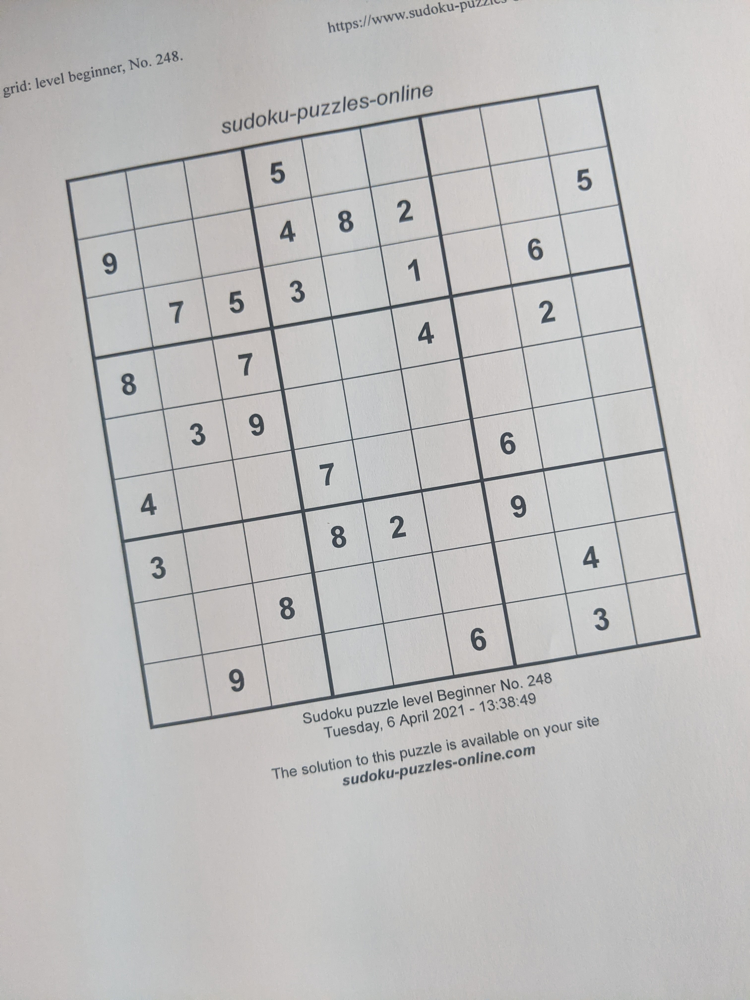
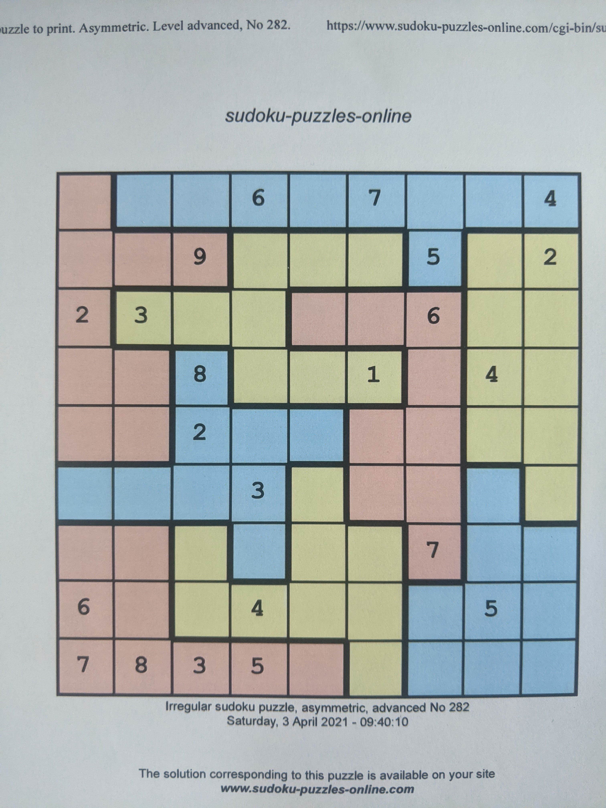
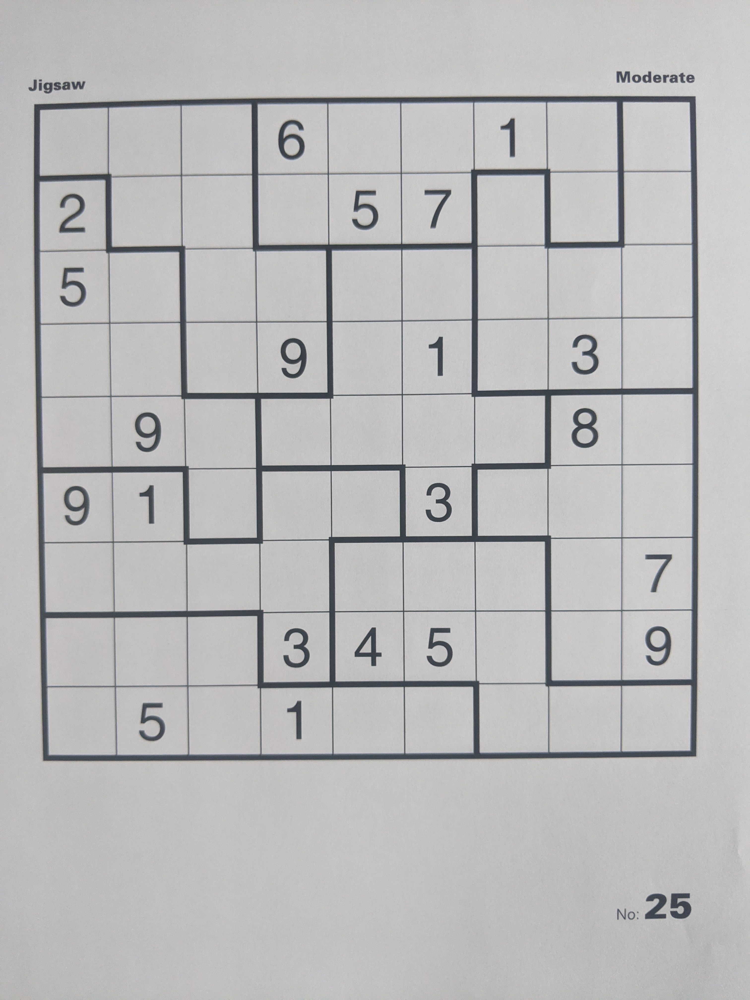

# Extract information from sudoku grids

Detecting sudoku grids patterns and recognizing digits using computer vision. In the training folder three type of sudoku grids pictures are given: classic, jigsaw and jigsaw colored. <code>run_project.py</code> script outputs txt file with whether or not there is a digit in a cell and the digit predicted. For the jigsaw grids, the zone of the cell is also detected, like shown in the examples bellow. Check Doc.pdf for mor detailed information over solution.

  

     ooo5ooooo 
    9oo482oo5 
    o753o1o6o 
    8o7oo4o2o 
    o39oooooo 
    4oo7oo6oo 
    3oo82o9oo 
    oo8oooo4o 
    o9ooo6o3o 
  

  

     1o2o2o262o272o2o24 
    1o1o193o3o3o254o42 
    12333o3o5o5o564o4o 
    1o1o683o3o315o444o 
    1o1o626o6o5o5o4o4o 
    6o6o6o637o5o5o8o4o 
    9o9o7o6o7o7o578o8o 
    969o7o747o7o8o858o 
    979893959o7o8o8o8o 
  

  

     1o1o1o262o2o212o3o 
    421o1o2o25273o2o3o 
    454o1o1o5o5o3o3o3o 
    4o4o1o195o513o333o 
    4o494o5o5o5o5o686o 
    79714o7o7o536o6o6o 
    7o7o7o7o8o8o8o6o67 
    9o9o9o7384858o6o69 
    9o959o919o9o8o8o8o 
  
  

<figure>
  
  <figcaption>
     1o2o2o262o272o2o24 
    1o1o193o3o3o254o42 
    12333o3o5o5o564o4o 
    1o1o683o3o315o444o 
    1o1o626o6o5o5o4o4o 
    6o6o6o637o5o5o8o4o 
    9o9o7o6o7o7o578o8o 
    969o7o747o7o8o858o 
    979893959o7o8o8o8o 
  </figcaption>
</figure>
<figure>
  
  <figcaption>
     1o2o2o262o272o2o24 
    1o1o193o3o3o254o42 
    12333o3o5o5o564o4o 
    1o1o683o3o315o444o 
    1o1o626o6o5o5o4o4o 
    6o6o6o637o5o5o8o4o 
    9o9o7o6o7o7o578o8o 
    969o7o747o7o8o858o 
    979893959o7o8o8o8o 
  </figcaption>
</figure>
 
The libraries required to run the project
<ul>
  <li>python==3.9.5</li>
  <li>numpy==1.19.5</li>
  <li>opencv_python==4.5.4.58</li>
  <li>tqdm==4.62.3</li>
</ul>
