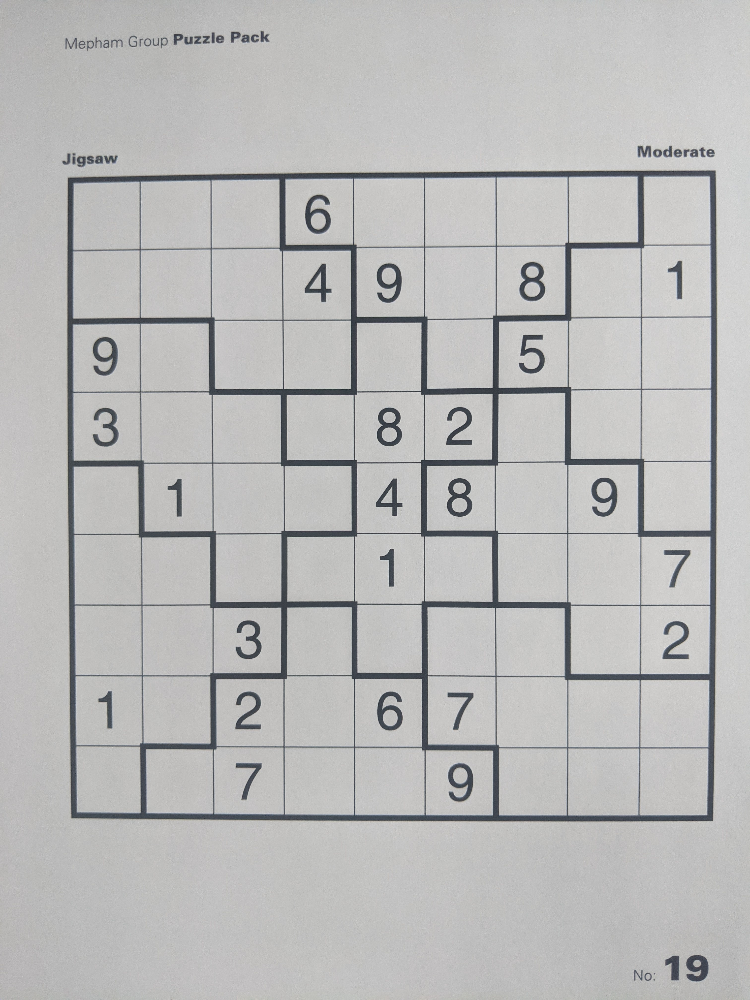
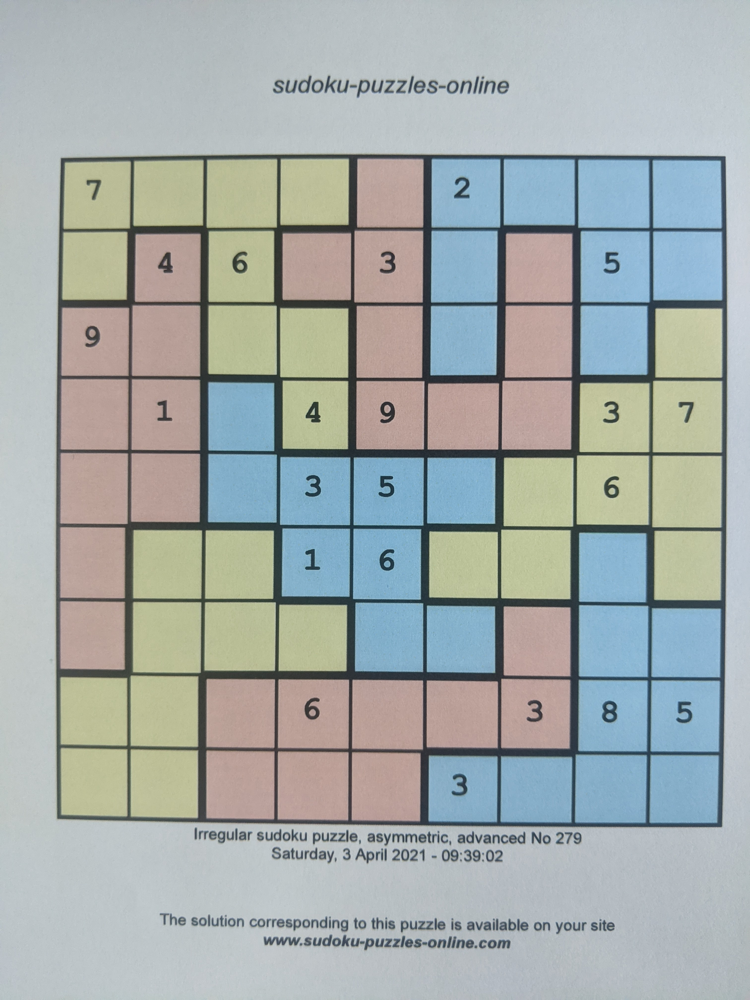

# Extract-information-from-sudoku-grids

Detecting sudoku grids patterns and recognizing digits using computer vision. In the training folder three type of sudoku grids pictures are given: classic, jigsaw and jigsaw colored. <code>run_project.py</code> script outputs txt file with whether or not there is a digit in a cell and the digit predicted. For the jigsaw grids, the zone of the cell is also detected, like shown in the examples bellow.

  
  
  

  
o68ooo5oo
o542o8ooo
7ooo5o8oo
ooo491ooo
oooooo3oo
oooo32o41
o9o3oo168
oo6o2oooo
41oo7ooo2

The libraries required to run the project
<ul>
  <li>python==3.9.5</li>
  <li>numpy==1.19.5</li>
  <li>opencv_python==4.5.4.58</li>
  <li>tqdm==4.62.3</li>
</ul>
